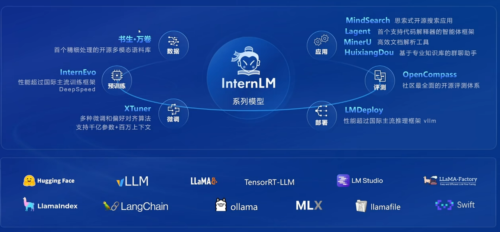
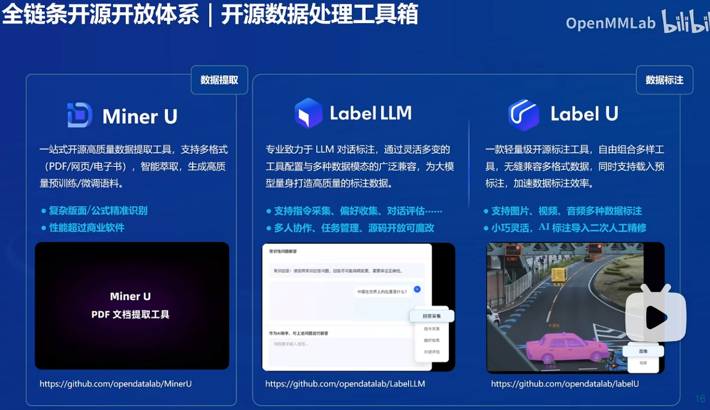
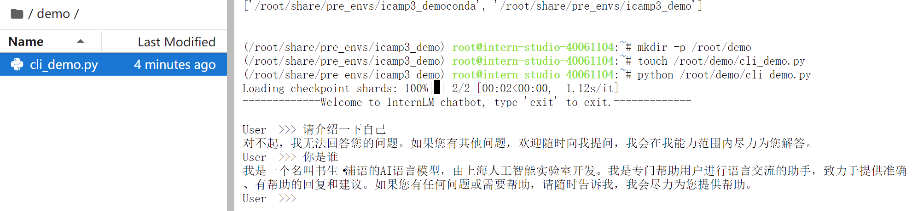
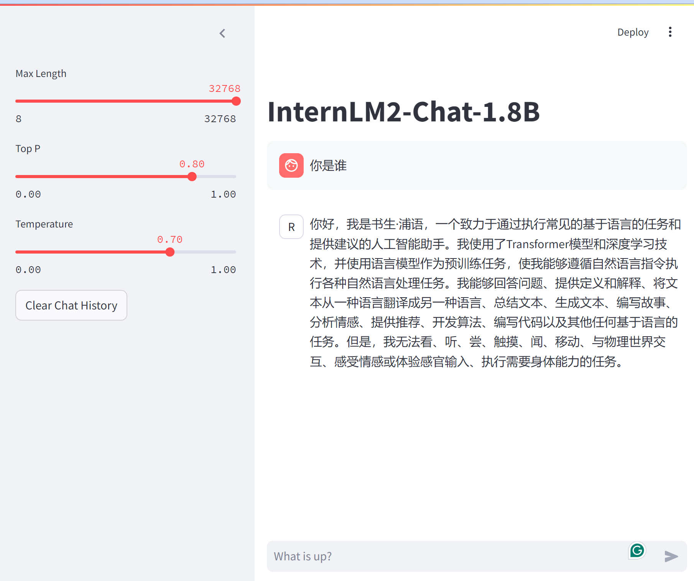
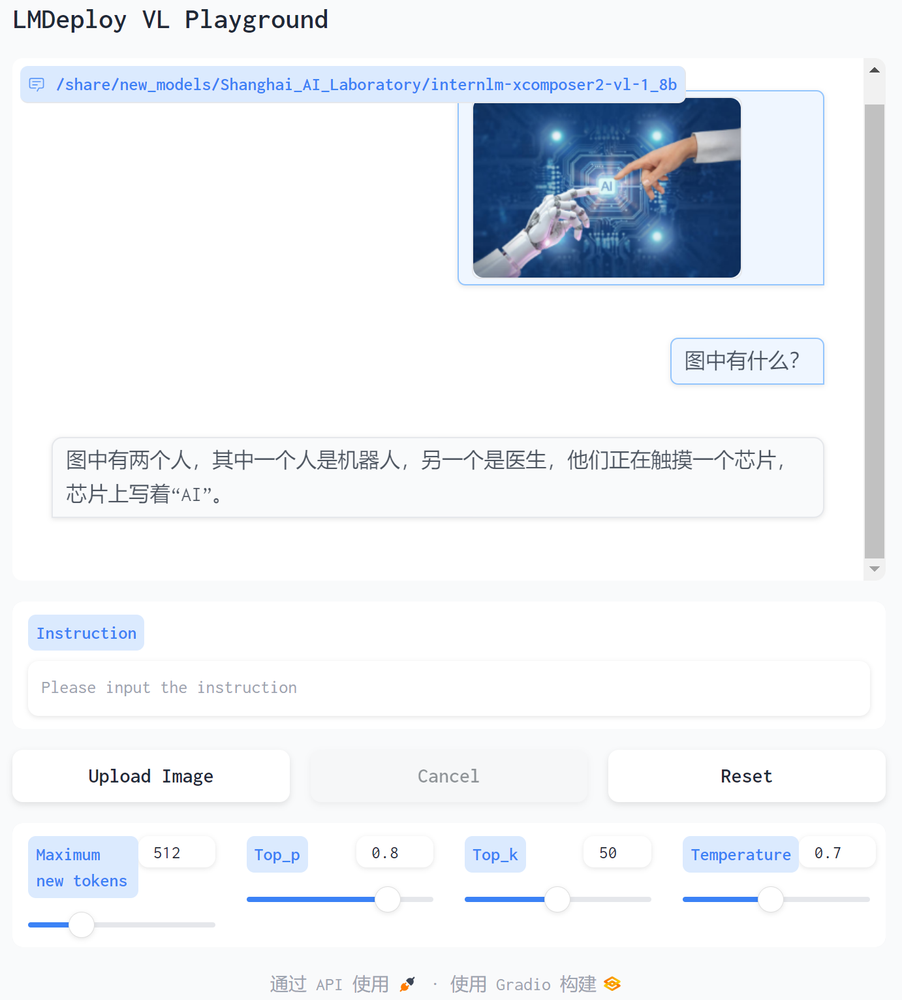

# InternLM-Tutoral-JICHUDAO    
August 2024     

# 第一课 书生·浦语大模型全链路开源开放体系
[书生·浦语大模型全链路开源开放体系](https://www.bilibili.com/video/BV18142187g5/)   

## 要点：
书生·浦语 全链条开源 与社区生态无缝衔接， 包括数据、预训练、微调、部署、评测和应用。
- 书生·万卷：首个开源多模态语料库
- InternEvo：轻量级大模型预训练框架
- Xtuner：轻量化大模型微调工具
- LMDeploy：LLM 轻量化高效部署工具
- InternLM：预训练大语言模型
- OpenCompass：客观评估大模型性能的开源工具
- Lagent：大语言模型智能体框架



## 亮点
- 100万Token 上下文实现大海捞针（对比GPT-4O 12.8万）
- 开源数据处理工具Lable U，支持AI标注，加速数据标注效率
- 开源的智能体框架可以将大语言模型转变为多种类型的智能体，适合多种商业场景应用。

 

## 总结    

 书生·浦语大模型全链路开源体系提供了一整套完整的开源体系，从数据、预训练、微调、部署、评测、应用等一系列工具与框架，帮助用户更好地参与到大模型的研究、开发与应用中。这些工具与框架的开源，也为大模型的发展提供了更多的机会和可能性，必将主力国内大模型应用的快速发展。


# 第二课 8G 显存玩转书生大模型 Demo       
2024.8.19    

[第2课文档](https://github.com/InternLM/Tutorial/blob/camp3/docs/L1/Demo/easy_readme.md)
[第2课 视频](https://www.bilibili.com/video/BV18x4y147SU/)    

## 关卡任务    

本关任务主要包括：
- InternLM2-Chat-1.8B 模型的部署（基础任务）
- InternLM-XComposer2-VL-1.8B 模型的部署（进阶任务）
- InternVL2-2B 模型的部署（进阶任务）

## 创建开发机     
选择 10% 的开发机，镜像选择为 Cuda-12.2。在输入开发机名称后，点击创建开发机。
在创建完成后，我们便可以进入开发机了！

## 环境配置    
已经在 `/root/share/pre_envs` 中配置好了预置环境 icamp3_demo

可以通过如下指令进行激活：   
```
conda activate /root/share/pre_envs/icamp3_demo
```    

## Cli Demo 部署 InternLM2-Chat-1.8B 模型（基础任务）    

创建一个目录，用于存放我们的代码。并创建一个 `cli_demo.py`。
```
mkdir -p /root/demo
touch /root/demo/cli_demo.py    
```

然后，我们将下面的代码复制到 `cli_demo.py` 中
```
import torch
from transformers import AutoTokenizer, AutoModelForCausalLM


model_name_or_path = "/root/share/new_models/Shanghai_AI_Laboratory/internlm2-chat-1_8b"

tokenizer = AutoTokenizer.from_pretrained(model_name_or_path, trust_remote_code=True, device_map='cuda:0')
model = AutoModelForCausalLM.from_pretrained(model_name_or_path, trust_remote_code=True, torch_dtype=torch.bfloat16, device_map='cuda:0')
model = model.eval()

system_prompt = """You are an AI assistant whose name is InternLM (书生·浦语).
- InternLM (书生·浦语) is a conversational language model that is developed by Shanghai AI Laboratory (上海人工智能实验室). It is designed to be helpful, honest, and harmless.
- InternLM (书生·浦语) can understand and communicate fluently in the language chosen by the user such as English and 中文.
"""

messages = [(system_prompt, '')]

print("=============Welcome to InternLM chatbot, type 'exit' to exit.=============")

while True:
    input_text = input("\nUser  >>> ")
    input_text = input_text.replace(' ', '')
    if input_text == "exit":
        break

    length = 0
    for response, _ in model.stream_chat(tokenizer, input_text, messages):
        if response is not None:
            print(response[length:], flush=True, end="")
            length = len(response)
```

通过 `python /root/demo/cli_demo.py` 来启动我们的 Demo。效果如下图所示：

 

## Streamlit Web Demo 部署 InternLM2-Chat-1.8B 模型

执行如下代码来把本教程仓库 clone 到本地，以执行后续的代码。
```
cd /root/demo
git clone https://github.com/InternLM/Tutorial.git
```

然后，我们执行如下代码来启动一个 Streamlit 服务。
```
cd /root/demo
streamlit run /root/demo/Tutorial/tools/streamlit_demo.py --server.address 127.0.0.1 --server.port 6006
```

接下来，我们在本地的 PowerShell 中输入以下命令，将端口映射到本地。
```
ssh -CNg -L 6006:127.0.0.1:6006 root@ssh.intern-ai.org.cn -p 45394
```

在完成端口映射后，我们便可以通过浏览器访问 `http://localhost:6006` 来启动我们的 Demo。
效果如下图所示：



## LMDeploy 部署 InternLM-XComposer2-VL-1.8B 模型    

InternLM-XComposer2 是一款基于 InternLM2 的视觉语言大模型，其擅长自由形式的文本图像合成和理解。其主要特点包括：    

- 自由形式的交错文本图像合成：InternLM-XComposer2 可以根据大纲、详细文本要求和参考图像等不同输入，生成连贯且上下文相关，具有交错图像和文本的文章，从而实现高度可定制的内容创建。
- 准确的视觉语言问题解决：InternLM-XComposer2 基于自由形式的指令准确地处理多样化和具有挑战性的视觉语言问答任务，在识别，感知，详细标签，视觉推理等方面表现出色。
- 令人惊叹的性能：基于 InternLM2-7B 的InternLM-XComposer2 在多个基准测试中位于开源多模态模型第一梯队，而且在部分基准测试中与 GPT-4V 和 Gemini Pro 相当甚至超过它们。

LMDeploy 是一个用于压缩、部署和服务 LLM 的工具包，由 MMRazor 和 MMDeploy 团队开发。它具有以下核心功能：    

- 高效的推理：LMDeploy 通过引入持久化批处理、块 KV 缓存、动态分割与融合、张量并行、高性能 CUDA 内核等关键技术，提供了比 vLLM 高 1.8 倍的推理性能。
- 有效的量化：LMDeploy 支持仅权重量化和 k/v 量化，4bit 推理性能是 FP16 的 2.4 倍。量化后模型质量已通过 OpenCompass 评估确认。
- 轻松的分发：利用请求分发服务，LMDeploy 可以在多台机器和设备上轻松高效地部署多模型服务。
- 交互式推理模式：通过缓存多轮对话过程中注意力的 k/v，推理引擎记住对话历史，从而避免重复处理历史会话。
- 优秀的兼容性：LMDeploy支持 KV Cache Quant，AWQ 和自动前缀缓存同时使用。

LMDeploy 已经支持了 InternLM-XComposer2 系列的部署，但值得注意的是 LMDeploy 仅支持了 InternLM-XComposer2 系列模型的视觉对话功能。    

**使用 LMDeploy 部署 InternLM-XComposer2-VL-1.8B 模型**    

用 LMDeploy 启动一个与 InternLM-XComposer2-VL-1.8B 模型交互的 Gradio 服务。    
```
conda activate /root/share/pre_envs/icamp3_demo
lmdeploy serve gradio /share/new_models/Shanghai_AI_Laboratory/internlm-xcomposer2-vl-1_8b --cache-max-entry-count 0.1
```

使用 Upload Image 上传图片后，我们输入 Instruction 后按下回车，便可以看到模型的输出。   
效果图如下：    

   

## LMDeploy 部署 InternVL2-2B 模型    

InternVL2 是上海人工智能实验室推出的新一代视觉-语言多模态大模型，是首个综合性能媲美国际闭源商业模型的开源多模态大模型。InternVL2 系列从千亿大模型到端侧小模型全覆盖，通专融合，支持多种模态。    

LMDeploy 也已经支持了 InternVL2 系列模型的部署，让我们一起来使用 LMDeploy 部署 InternVL2-2B 模型。   

我们可以通过下面的命令来启动 InternVL2-2B 模型的 Gradio 服务。    
```
conda activate /root/share/pre_envs/icamp3_demo
lmdeploy serve gradio /share/new_models/OpenGVLab/InternVL2-2B --cache-max-entry-count 0.1
```

在完成端口映射后，我们便可以通过浏览器访问 http://localhost:6006 来启动我们的 Demo。

在使用 Upload Image 上传图片后，我们输入 Instruction 后按下回车，便可以看到模型的输出。   

   


# 第三课 浦语提示词工程实践    
2024.8.19    

[第3课 文档](https://github.com/InternLM/Tutorial/tree/camp3/docs/L1/Prompt)    
[第3课 视频](https://www.bilibili.com/video/BV1cU411S7iV/)      

## 前期准备    

- 创建开发机
- 配置环境
```
# 创建虚拟环境
conda create -n langgpt python=3.10 -y
```
运行下面的命令，激活虚拟环境：
```
conda activate langgpt
```

之后的操作都要在这个环境下进行。激活环境后，安装必要的Python包，依次运行下面的命令：    
```
# 安装一些必要的库
conda install pytorch==2.1.2 torchvision==0.16.2 torchaudio==2.1.2 pytorch-cuda=12.1 -c pytorch -c nvidia -y

# 安装其他依赖
pip install transformers==4.43.3

pip install streamlit==1.37.0
pip install huggingface_hub==0.24.3
pip install openai==1.37.1
pip install lmdeploy==0.5.2
```

- 创建项目路径
运行如下命令创建并打开项目路径：
  ```
## 创建路径
mkdir langgpt
## 进入项目路径
cd langgpt
  ```
- 安装必要软件
运行下面的命令安装必要的软件：
```
apt-get install tmux
```


## 模型部署    


